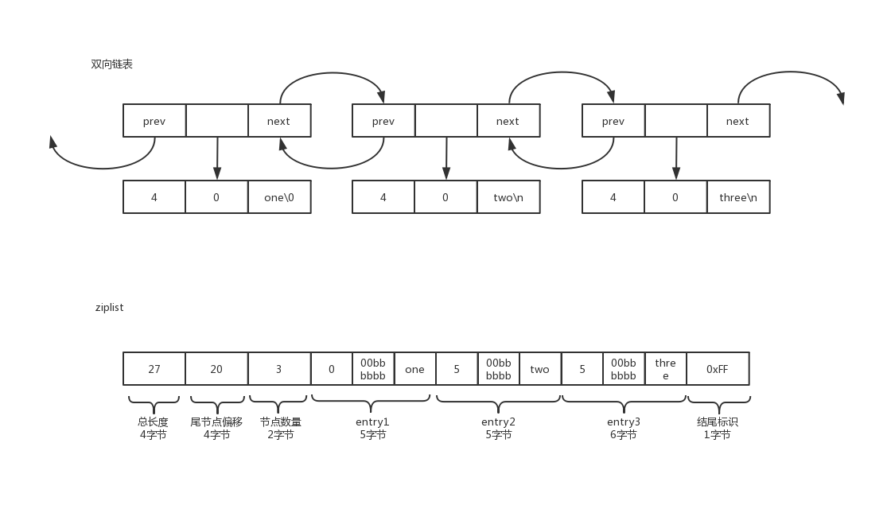

# 一个内存kv数据库会慢在哪儿

我们首先来看一个请求从到达我们数据库服务器的网卡开始，一直到网卡开始发送返回报文之间，都需要花费哪些时间。

https://www.cubrid.org/blog/understanding-tcp-ip-network-stack

以`*nix`系统为例，首先是数据链路层的包到达网卡内存缓冲区，网卡做一系列校验，如CRC，再产生中断通知CPU。
CPU开始处理中断程序，进行网络协议的层层拆包，从数据链路层，IP层，TCP层，Sockets层（假定我们使用的是TCP协议栈），最后把数据复制到对应文件描述符（FD)的内存空间中。
此时，用户程序还没有开始处理，我们暂且不讨论这部分。

至此，用户进程已经可以从FD中通过[read](https://linux.die.net/man/2/read)系统调用读取到数据。
接下来，用户进程会从FD中读取数据库操作指令，让我们假设是一个简单KV的SET命令，key和value都是字符串，那么首先要对key做一次hash，找到该key存放的位置，如果key已经在内存中了，一次内存写操作就足够了。但如果key没有在内存中，那就需要一次额外的IO操作来将key从磁盘中读取到内存中。
这部分

最后，用户进程需要组装返回数据，假设只是简单的成功或者失败，并写入对应的FD中，`*nix`内核会负责把数据层层组装，并有网卡驱动通知网卡进行数据发送。

|||
|---|---
|IO|
|page fault|
|hash latency|

* 网络IO

参考：

https://www.zhihu.com/question/47589908

# 事件模型优化

为什么redis要自己做eventlib

https://groups.google.com/forum/#!topic/redis-db/tSgU6e8VuNA

# 内存模型优化

上文说到，page fault是内存数据库慢的关键，一旦某一个请求的过程中产生了page fault，那这个请求会慢不止一个数量级。Redis中针对不同的数据类型和大小，使用了不同的encoding方式，以使得内存占用量尽可能小

1. ziplist

   如果一个List或者HashSet中的元素都是长度较短的小整数，或者短字符串时（事实上这是绝大多数场景），redis会使用ziplist作为底层存储已节约内存空间

   

   如果我们用一个普通的双向链表去存储一个包含三个字符串的list："one", "two", "three"，如下图所示，不考虑固定开销（如链表的head，tail指针之类）在一个32位的系统上我们最少需要`21字节`（指向下一个节点的指针4字节+指向上一个节点的指针4字节+指向数据块的指针4字节+数据块大小存储4字节+数据块剩余字节存储4字节+数据块结尾'\0'1字节）的额外空间去存储`3字节`真正的数据。

   ziplist的节省空间方式很简单，用保存前一个节点数据长度的方式代替指针，一个小于`254字节`的节点，只需要`1字节`来存储长度，而用指针，则需要`4字节`。还是上述的例子，不考虑固定开销（压缩链表的总长度，尾部节点指针之类），每存储`3字节`的真正数据，只需要`2字节`（前一个节点的长度1字节+编码属性1字节）

2. rehash

   随着redis接收的操作越来越多，内存中维护的哈希表的负载因子会增大或缩小。为了维护一个合理的负载因子，我们需要对哈希表进行相应的扩展或者收缩。无论是扩展还是收缩，redis都会选择生成一张新的哈希表ht1。
   并将原先的哈希表ht0中的数据逐渐迁移到ht1中，这个过程描述如下：

   1. 将`rehashidx`设置为0，表示迁移开始，并初始化ht1
   2. 所有对哈希表的添加、删除、查找或者更新操作，都在原操作的基础上新增一次对当前key的迁移动作，并将`rehashidx`+1
   3. 系统每隔一段时间（时机和删除过期键相同）会主动触发一次限时1ms的迁移
   4. 系统将重复2、3直到ht0中所有元素都迁移完成

# 算法优化

1. hash

   Redis采用的[MurmurHash](https://sites.google.com/site/murmurhash/)算法，该算法
   1. 极致简洁 - 在x86系统上大概只有52条指令
   2. 极好的随机分布性 - 在几乎所有的键集和桶大小下通过了[Chi-square test](https://en.wikipedia.org/wiki/Chi-square_test)
   3. 极好的冲突避免能力
   4. [性能极佳](https://www.strchr.com/hash_functions) - 在Intel Core 2 Duo @ 2.4ghz上测试结果

      ```
      OneAtATime - 354.163715 mb/sec
      FNV - 443.668038 mb/sec
      SuperFastHash - 985.335173 mb/sec
      lookup3 - 988.080652 mb/sec
      MurmurHash 1.0 - 1363.293480 mb/sec
      MurmurHash 2.0 - 2056.885653 mb/sec
      ```

2. skip list

# 参考

https://redislabs.com/ebook/part-2-core-concepts/

https://redis.io/topics/faq

https://www.zhihu.com/question/19764056

https://zhuanlan.zhihu.com/p/65013389