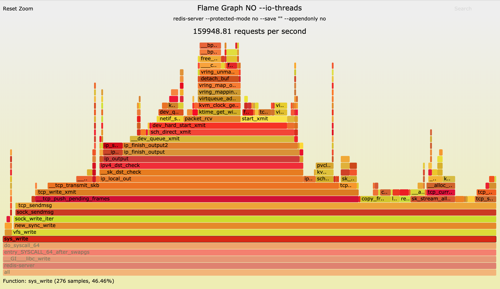
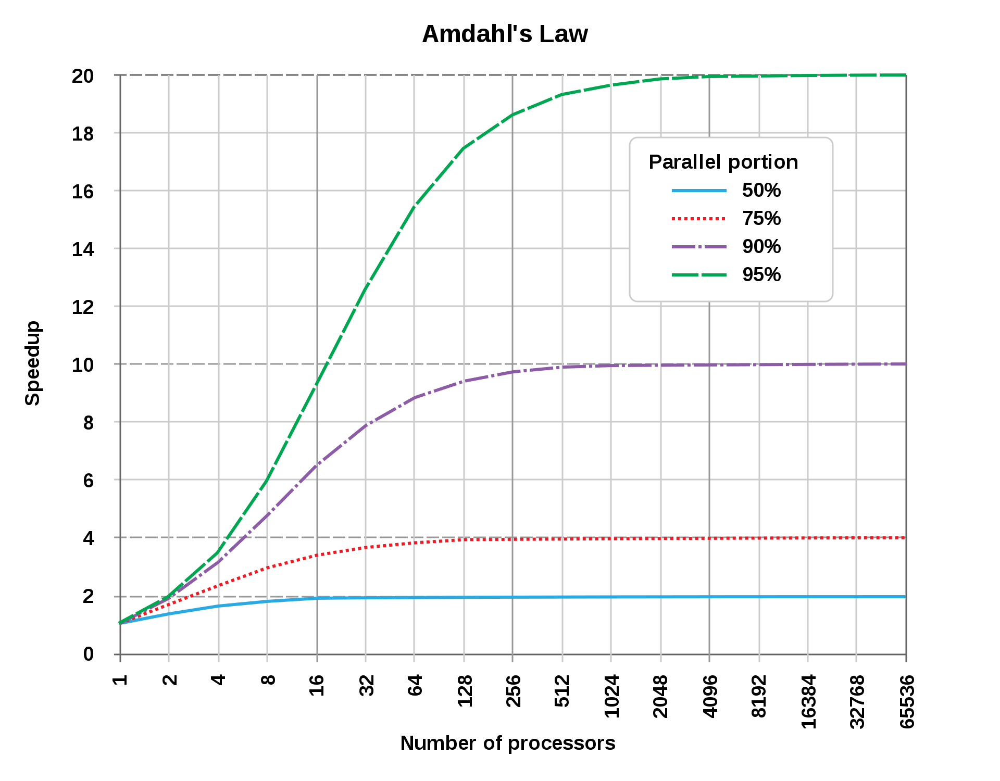

原文地址：https://itnext.io/benchmarking-the-experimental-redis-multi-threaded-i-o-1bb28b69a314?gi=b87fffac2b2e

原作者：[Filipe Oliveira](https://www.linkedin.com/in/filipecosta90/)，Performance Engineer at Redis Labs

人们普片觉得Redis是单进程，单线程模式的应用。但是对于新版本的Redis来说，这已经不成立了。

引用[Redis官方文档](https://redis.io/topics/faq)：

```
从Redis4.0开始，我们开始让Redis使用更多的线程。
当前多线程仅应用在后台删除对象，阻塞Redis模块中实现的命令。
下一个版本，我们计划引入更多的多线程处理。
```

Redis在后台跑了很多线程，用来做清理工作，包括清理脏数据，关闭文件描述符FD等等。Redis也不是单进程的，因为在后台保存数据的时候，Redis也会fork子进程。

让我们设想一个最简单的方式来让Redis更加多线程化：每当Redis需要处理读、写操作的时候，我们都调度N个空闲的IO线程来处理。由于我们还是用主线程来响应大部分任务，这么处理并不会增加太多的复杂性。反倒是由于Redis大部分的时间都用来处理IO了，我们能得到更多的好处，我们需要认识到的是：Redis是内存或者网络密集型的。

1. Redis虚拟机调优，找到Redis代码中的"CPU热点"

   为了找到Redis究竟花了多少时间在IO上，我们在GCP上申请了两台**n1-highcpu-96**实例，其中一台作跑redis-server(多线程IO版本)，另一台跑redis-benchmark。

   为了让redis-server能跑的更效率写，我们调优了实例上的某些参数：

   * 禁用**tuned**和**ktune**电量节省相关机制
   * 启用**sysctl**设置，以加速磁盘和网络IO，并使用**deadline scheduler**
   * 设置CPU调节器为`performance`参数
   * 禁用透明大页(Transparent Huge Pages)
   * 调整最大监听队列队列长度(somaxconn)为65535【译者注：默认为1024】
   * 设置vm.overcommit_memory参数，从0(默认值)改为1(从不拒绝任何的malloc)

   以上修改可以用下面的命令完成。最后的一行命令确保了sysctl设置能够立即生效。

   ```bash
   sudo -i
   echo never > /sys/kernel/mm/transparent_hugepage/enabled
   sysctl -w vm.overcommit_memory=1
   sysctl -w net.core.somaxconn=65535
   sysctl -p
   ```

   1. 单线程redis-server性能分析

      1. redis-server虚拟机

         我们已经把虚拟机实例调优完了，可以用下面的配置启动redis-serverle了

         ```bash
         fcosta_oliveira@n1-highcpu-96-redis-server-1:/redis-server --protected-mode no --save "" --appendonly no   --daemonize yes
         ```

      2. redis-benchmark虚拟机

         为了衡量Redis的性能，产生足以分析Redis性能的负载，我们在这篇文章中大量使用了redis-benchmark。官方的redis-benchmark是生成测试结果快速而有效的方式。

         我们从官方的redis-benchmark中fork了一个[版本](https://github.com/filipecosta90/redis/tree/benchmark_xadd)，并增加了一些新的针对Streams数据类型的测试。我们已经提交了[PR](https://github.com/antirez/redis/pull/6015)。

         这部分的讨论中，我们只想知道Redis花了多少时间在IO上，以用来根据阿姆达尔定律【译者注：[阿姆达尔定律](https://en.wikipedia.org/wiki/Amdahl%27s_law)为并行计算系统的设计者提供了理论指导】来预测使用并行处理的理论速度增长。
         为了达到这个目的，我们使用新的多线程redis-benchmark，创建15个客户端，来发送10M个键大小为100字节的GET命令。

         ```bash
         fcosta_oliveira@n1-highcpu-96-redis-benchmark-1:~/redis-benchmark -t get -c 150 -n 10000000 — threads 46 -h {ip of redis-server vm} -d 100
         ```

      3. 跑基准测试时的栈调用分析
      
         在**n1-highcpu-96-redis-benchmark-1**虚拟机上跑基准测试的同时，我们用Linux的perf_events(也叫"perf")命令以99Hz的抽样率进行栈抽样。

         ```bash
         fcosta_oliveira@n1-highcpu-96-redis-server-1:~/sudo perf record -F 99 — pid `pgrep redis-server` -g -o 100_bytes_no_iothreads
         ```

         结果长这样：

         

         在使用多线程IO实验版Redis提升性能之前，redis-server的执行时间如上图所示。这其中包括了会提升的部分和不会提升的部分。根据上图所示的情况，有46.6%的执行时间(sys_write)是有可能被多线程IO实验版Redis提高的。

         性能提升的上限，是程序中哪些还在串行的部分。在我们的例子中是53.4%。也就是说，理论上，我们最多提升2倍的性能，也就是下图中蓝线部分。

         

2. 为基准测试设置硬上限

   1. 网络硬上限

      网络带宽和延迟通常会对Redis性能产生直接的影响。在深入我们的基准测试之前，我们先来用qperf命令检查一下跑基准测试和redis-server的两台虚机之前的网络延迟。

      下面打印的实验结果，实在单租户，无竞争的网络环境中，在这样的网络环境中，没有后台的其他程序使用网络，因此也不存在网络干扰。
      
      ```bash
      fcosta_oliveira@n1-highcpu-96-redis-benchmark-1:~/qperf$ qperf -t 60 -v {ip of redis-server vm} tcp_bw 
      tcp_lattcp_bw:    
         bw              =  3.05 GB/sec    
         msg_rate        =  46.5 K/sec    
         time            =    60 sec    
         send_cost       =   248 ms/GB    
         recv_cost       =   181 ms/GB    
         send_cpus_used  =  75.6 % cpus    
         recv_cpus_used  =  55.3 %
      cpustcp_lat:    
          latency        =  27.6 us    
          msg_rate       =  36.3 K/sec    
          time           =    60 sec    
          loc_cpus_used  =  14.6 % cpus    
          rem_cpus_used  =  15.9 % cpus
      ```

      我们可以看出，网络带宽是3.05GB/s(24.4Gbit/s)。之前的基准测试以100 Bytes作为Redis键，可以计算出，网络硬上限是每秒32,000,000次。
      
   2. 内存硬上线
   
      让我们先来看看Redis官方文档
      
      ```
      RAM速度和内存带宽似乎对整体性能没有什么影响，尤其是对小对象来说。对于大对象(>10KB)，有可能观察到影响
      ```
      
      尽管如此，我们还是会用STREAM对虚拟机内存带宽做基准测试，该基准测试的目的是为了测试long vectors，STREAM也是研究，测试和市场销售中最常用到的。
      
      下面的命令会获取一个STREAM，并设置一个大于n1-highcpu-96缓存大小的数组。我们重复测试十次，并剔除第一次的结果。
      
      ```bash
      git clone https://github.com/jeffhammond/STREAM.git
      cd STREAM/
      gcc -fopenmp -D_OPENMP -O -DSTREAM_ARRAY_SIZE=100000000 stream.c -o stream.100M
      export OMP_NUM_THREADS=48
      ./stream.100M
      ```
      
      第二次的结果如下:
      
      ```
      fcosta_oliveira@n1-highcpu-96-redis-server-1:~/STREAM$ ./stream.100M 
      -------------------------------------------------------------
      STREAM version $Revision: 5.10 $
      -------------------------------------------------------------
      This system uses 8 bytes per array element.
      -------------------------------------------------------------
      Array size = 100000000 (elements), Offset = 0 (elements)
      Memory per array = 762.9 MiB (= 0.7 GiB).
      Total memory required = 2288.8 MiB (= 2.2 GiB).
      Each kernel will be executed 10 times.
       The *best* time for each kernel (excluding the first iteration)
       will be used to compute the reported bandwidth.
      -------------------------------------------------------------
      Number of Threads requested = 48
      Number of Threads counted = 48
      -------------------------------------------------------------
      Your clock granularity/precision appears to be 1 microseconds.
      Each test below will take on the order of 15223 microseconds.
         (= 15223 clock ticks)
      Increase the size of the arrays if this shows that
      you are not getting at least 20 clock ticks per test.
      -------------------------------------------------------------
      WARNING -- The above is only a rough guideline.
      For best results, please be sure you know the
      precision of your system timer.
      -------------------------------------------------------------
      Function    Best Rate MB/s  Avg time     Min time     Max time
      Copy:           83936.4     0.020901     0.019062     0.022618
      Scale:          83927.0     0.022181     0.019064     0.034278
      Add:            93240.4     0.027765     0.025740     0.031065
      Triad:          93959.3     0.027276     0.025543     0.030629
      -------------------------------------------------------------
      Solution Validates: avg error less than 1.000000e-13 on all three arrays
      -------------------------------------------------------------
      ```
      
      我们可以观察到，Copy最高能达到83GB/s。那么在我们的例子中，一个100字节大小的键能最多获得每秒890,000,000次查询。我们并不是要在这里讨论不同的内存访问方式 - 
      我们测量出的最佳速率和硬上限，可以帮助我们粗略的进行估算。
      
3. 用不同的配置跑基准测试

   